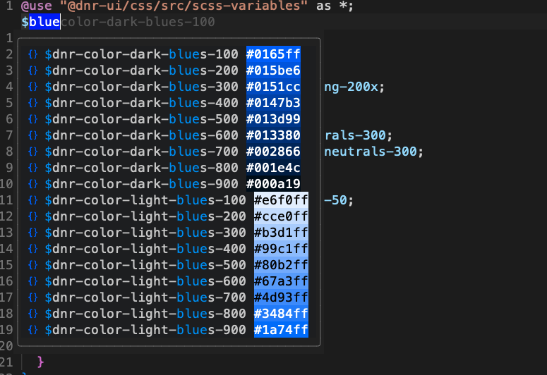

# cmp-scss

[nvim-cmp](https://github.com/hrsh7th/nvim-cmp/tree/main) plugin that scans specified node_modules for scss variable files



## Setup

The only thing you have to add in the option table are the folders you want cmp-scss to search for variable scss files.

```lua
require'cmp'.setup {
  sources = {
    {
        name = 'scss',
        option = {
            folders = { "node_modules/@dnr-ui/tokens/scss" }
        }
    }
  }
}
```

## Configuration

You can change the start trigger(s), the extension it will search for, the filter pattern, and the folder(s) it will search for files in.

```lua
require'cmp'.setup {
  sources = {
    {
        name = 'scss',
        option = {
            triggers = { "$" }, -- default value
            extension = ".scss", -- default value
            pattern = [=[\%(\s\|^\)\zs\$[[:alnum:]_\-0-9]*:\?]=], -- default value
            folders = { "node_modules/@dnr-ui/tokens/scss" },
        }
    }
  }
}
```
